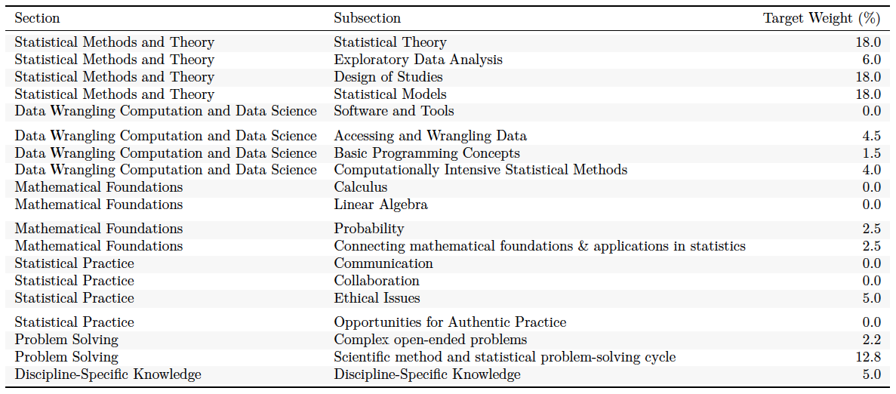

```{r setup, include=FALSE}
knitr::opts_chunk$set(echo = FALSE)

library(tidyverse)
library(kableExtra)

```

# Collaborators 

- Matt Beckman (Penn State)
- Beth Chance (Cal Poly--San Luis Obispo)
- Kirsten Eilertson (Penn State)
- Jennifer Kaplan (Georgia)
- Kari Lock Morgan (Penn State)
- Paul Roback (Saint Olaf College)

&nbsp;

*Funding: Penn State Center of Excellence in Science Education*

# Assessment Outline  

- **Goal: Measure learning outcomes of students upon completion of undergraduate statistics program (e.g. major)**
    - snapshot of student learning outcomes  
    - facilitate cohort comparisons for program evaluation 
    - comprehensive scope
- Constraints
    - closely aligned to (2014) ASA Curriculum Guidelines[^1]
    - ease of use across institutions, instructors, years 
- Outcomes
    - two capstone assessment tools (i.e., test & survey)
    - multi-year pilot
    - good psychometric quality

[^1]: American Statistical Association Undergraduate Guidelines Workgroup (2014). 2014 Curriculum guidelines for undergraduate programs in statistical science. Alexandria, VA: American Statistical Association. http://www.amstat.org/education/curriculumguidelines.cfm


# (2014) ASA Guidelines for Undergraduate Programs in Statistical Sciences

{ width=95% }


# Comprehensive Undergraduate Statistics Program (CUSP) Assessment Strategy

- 95 competencies cited in 2014 ASA Guidelines  
- single assessment tool likely not sufficient


| # Competencies | ASA Guidelines Topic | 
|:--------------:|:-----------|
| 37 |  Statistical Methods & Theory |
| 16 |  Data Wrangling, Computing, & Data Science |
| 11 |  Mathematical Foundations |
| 18 |  Statistical Practice |
| 9  | Problem Solving |
| 4  | Discipline-Specific Knowledge |

# Comprehensive Undergraduate Statistics Program (CUSP) Assessments

- Direct assessment--CUSP Test
    - selected response test
    - approx. 1 hour duration
    - multiple institutions w. single cohort
    - single institution w. multiple cohorts
- Indirect assessment--CUSP Survey
    - inventory of all 95 competancies cited in ASA Guidelines  
    - survey data self-reported by students
    - approx. 10-15 minutes duration
    - several cohorts from single institution 


# CUSP Survey 

- **Benefits**
    - Easy implementation
    - Can be administered multiple times if desired  
    - No problem including topics we don't teach
    - Includes demographics
- **Risks/Issues**
    - Reliability of self-reporting 
    - Over/Underconfidence with content exposure


### Excerpt

{ width=80% }


# CUSP Test Design

- Selected response assessment tool with broad coverage
- 33 tasks; some with multiple parts
    - 9 testlets  
    - 24 conventional MC questions
- several tasks/subtasks assess multiple competancies
    - diminishing weight attributed to successive competancies (1, 1/2, 1/4, ...)
    - 86 points possible
- Mix of original tasks & some from established instruments (used with permission)
    - 2 from the REGRESS assessment[^2] 
    - 9 from the CAOS assessment[^3]


[^2]: Enders, F. (2013). Do clinical and translational science graduate students understand linear regression? Development and early validation of the REGRESS quiz. *Clinical and Translational Science, 6*(6).  p. 444-451. 

[^3]: delMas, R., Garfield, J., Ooms, A., Chance, B. (2007). Assessing students' conceptual understanding after a first course in statistics.  *Statistics Education Research Journal, 6*. p. 28-58.


# CUSP Test 

### Excerpt (partial item)

{ width=80% }


# CUSP Test

- **Benefits**
    - test statistical "reflexes" of students
    - built-in "CAOS" subtest
    - objective measure of student competancies
        - for individual students
        - for a cohort of students
        - aggregate useful for program evaluation
    - Easy implementation
- **Risks/Issues**
    - Variable use conditions may jeopardize comparisons
    - Scope constrained by test fatigue
    - Includes topics we don't necessarily teach
    - Longer to implement 

<!-- ### Penn State use  -->
<!--     - benchmarking student skills and competancies against ASA Guidelines -->
<!--     - identify areas of need just prior to graduation -->
<!--     - annual program evaluation data  -->


# Preliminary Item Functioning Analysis

- Benchmarks for item statistics[^4]
    - Unidimensionality assumed by common methods of assessment evaluation
    - Cronbach alpha (reliability)
    - descrimination > 0.15 preferred 
    - 0.6 < proportion correct < 0.9
- Results
    - PCA evidence supports unidimensionality
    - Cronbach alpha = 0.81
    - 30/33 items with discrimination > 0.15
    - 9/33 items in recommended difficulty range
    - 21/33 items with > 50% correct
    
[^4]: Haladyna, T. M., & Rodriguez, M. C. (2013). *Developing and validating test items*. Routledge: New York.


# Item discrimination

- Item discrimination < 0.15
    - (21% correct) Validity of models aligned to a study design
    - (3.6% correct) Strategies to maximize likelihood
    - (40% correct) CAOS task about CI interpretation
- Best item discrimination
    - (discrim = 0.59) Probability distributions task 
    - (discrim = 0.50) Histograms & std deviation task
    - (discrim = 0.46) OLS regression assumptions task


{ width=80% }


# Future work

### Shorter term goals

- Streamline logistics for wider implementation 
- Link CUSP Survey data to CUSP Test outcomes
- Expand item bank

### Longer term goals

- Experimentation with short/long forms
- Alternative or additional tools for more complete alignment to ASA Guidelines


# Acknowledgments

- Advisory input
    - Nick Horton
    - Allan Rossman
- Pilot testers
    - Heather Smith
    - Andrew Schaffner
    - Nicole Lazar
    - Lynne Seymour
    - Paul Roback
    - Kirsten Eilertson
    - Dave Hunter
    - Christian Schmid
    - Daisy Philtron

# Thank you


{ width=95% }


# Backup slides

### CUSP Test blueprint alignment to ASA Guidelines

{ width=95% }


# Student Results (Front)

{ width=80% }

# Student Results (Back)

{ width=80% }


# Scree plot of CUSP test data

{ width=70% }


